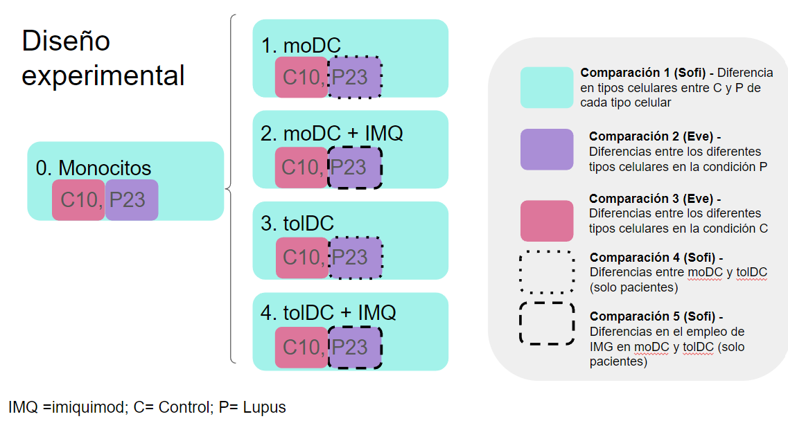

# bulkRNA_lupus2023

**Important files location**

- Fasta files: `/mnt/Citosina/amedina/cdiaz/usftp188.novogene.com/01.RawData/`
- Raw Salmon output files: `/mnt/Citosina/amedina/alhernandez/Lupus/DGE_SS/ASE/resultados/star_salmon/QR*/quant.sf`
- Working Directory: `/mnt/Citosina/amedina/lupus/RNA_lupus/`
- Metadata: `/mnt/Citosina/amedina/lupus/RNA_lupus/metadata/metadata.csv`
- Imported counts with tximport (dds): `/mnt/Citosina/amedina/lupus/RNA_lupus/counts/dds_txi.RData`
- dds + vst counts: `/mnt/Citosina/amedina/lupus/RNA_lupus/counts/dds_vsd.RData`

- Patient-Control analysis per cell type files (scripts and figures): `/mnt/Citosina/amedina/lupus/RNA_lupus/DE_P_C_celltypes`

Put your results in the [slides](https://docs.google.com/presentation/d/1BnyCKKPgfXBw9XkvsQ5q5YqqkvZhU0goQJVFWjv50fk/edit?usp=sharing)
